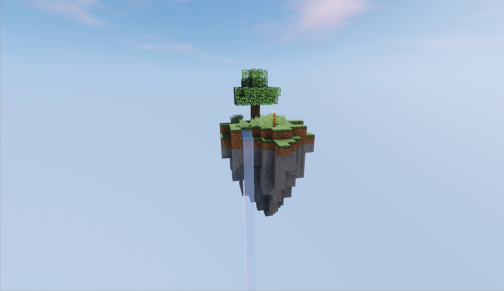

<!--
*** Thanks for checking out the Best-README-Template. If you have a suggestion
*** that would make this better, please fork the repo and create a pull request
*** or simply open an issue with the tag "enhancement".
*** Don't forget to give the project a star!
*** Thanks again! Now go create something AMAZING! :D
-->

<!-- PROJECT SHIELDS -->
<!--
*** I'm using markdown "reference style" links for readability.
*** Reference links are enclosed in brackets [ ] instead of parentheses ( ).
*** See the bottom of this document for the declaration of the reference variables
*** for contributors-url, forks-url, etc. This is an optional, concise syntax you may use.
*** https://www.markdownguide.org/basic-syntax/#reference-style-links
-->
[![Contributors][contributors-shield]][contributors-url]
[![Forks][forks-shield]][forks-url]
[![Stargazers][stars-shield]][stars-url]
[![Issues][issues-shield]][issues-url]
[![MIT License][license-shield]][license-url]

<!-- PROJECT LOGO -->
 

  

<h3 align="center">Remake Hypixel SkyBlock Branch</h3>

  

    fixes and addons for Exortions/SkyBlock
     
    <a href="https://github.com/Exortions/SkyBlock/wiki"><strong>Explore the wiki »</strong></a>
     
     
    <a href="https://github.com/froggors/SkyBlock">View Demo</a>
    ·
    <a href="https://github.com/froggors/SkyBlock-main/issues">Report Bug</a>
    ·
    <a href="https://github.com/froggors/SkyBlock-main/issues">Request Feature</a>
  

<!-- TABLE OF CONTENTS -->

  
Table of Contents

  <ol>
    <li>
      <a href="#about-the-project">About The Project</a>
      <ul>
        <li><a href="#built-with">Built With</a></li>
      </ul>
    </li>
    <li>
      <a href="#getting-started">Getting Started</a>
      <ul>
        <li><a href="#prerequisites">Prerequisites</a></li>
        <li><a href="#installation">Installation</a></li>
      </ul>
    </li>
    <li><a href="#features">Features</a></li>
    <li><a href="#usage">Usage</a></li>
    <li><a href="#roadmap">Roadmap</a></li>
    <li><a href="#contributing">Contributing</a></li>
    <li><a href="#license">License</a></li>
    <li><a href="#contact">Contact</a></li>
    <li><a href="#acknowledgements">Acknowledgements</a></li>
  </ol>

<!-- ABOUT THE PROJECT -->
## About The Project

(<a href="#top">back to top</a>)

### Built With

This section is all of the frameworks/applications that were used in the process of making this Hypixel SkyBlock Remake. You can see some smaller things towards the bottom of this page in the Acknowledgements section.
* [IntelliJ](https://www.jetbrains.com/idea/)
* [Maven](https://maven.apache.org/)
* [Spigot](https://www.spigotmc.org/)

(<a href="#top">back to top</a>)

### Prerequisites

  Here's the great thing about all of this: You don't need any other plugins to run this SkyBlock Remake! The plugin is also coded in the most efficient way, to prevent lag & unwanted glitches/bugs.

### Installation

If you want to install this for yourself, and only yourself (Limited to a small group of friends) for a Minecraft server, you can do so with the following instructions.
IF YOU ARE TRYING TO PROFIT OFF OF THIS PLUGIN, PLEASE BE WARNED THAT IT IS NOT LEGAL, AS THE GAME SKYBLOCK IS OWNED BY [HYPIXEL](https://hypixel.net/), AND THIS IS A FUN SIDE PROJECT THAT IS NOT MEANT TO BE FOR COMMERCIAL USE.
1. Ensure that your server .jar is Spigot 1.8.9
2. Download the dependencies from the dependencies folder
3. Download a release from the Releases section.
4. Move the downloaded JAR into your server plugins folder
   `MainServerFolder/plugins`
4. Restart your server.
5. Download the SkyBlock hub [here](https://www.mediafire.com/file/rosqqsrtqidkly1/Hypixel_-_Skyblock_Hub.zip/file)
6. Make the SkyBlock hub your spawning world
7. Stop your server
8. Take the private_island.schematic file from the dependencies folder and put it in 
  `MainServerFolder/plugins/RemakeHypixelSkyblock/`
10. Start your server again.
11. Log onto the server! Bam! You now have SkyBlock running on your private server.
Important note: Launch pads and custom mob spawning locations won't work because you need to edit the mobspawns.yml and the launchpad.yml. Those files will directly be added later to the GitHub.

(<a href="#top">back to top</a>)

<!-- FEATURES -->
## Features

Current Features
 - Private Islands
 - Stats
 - Custom Mobs
 - Slayers
 - Skills
 - Launch Pads
 - Regions/Locations

Coming Soon
 - Collections
 - Merchants
 - Dragons

Not Coming Soon
 - Dungeons
 - Bazaar 
 - Auctions

<!-- USAGE EXAMPLES -->
## Usage

As said above, if you are downloading this project, you agree to the policy/terms/conditions of this project. Do not attempt get commercial use from this project, because the idea of Hypixel SkyBlock was created by the Hypixel admins, therefore I do not have the right to give this out to people for them to make money off of.

(<a href="#top">back to top</a>)

<!-- ROADMAP -->
## Roadmap

See the [open issues](https://github.com/froggors/SkyBlock-main/issues) for a list of proposed features (and known issues).

(<a href="#top">back to top</a>)

<!-- CONTRIBUTING -->
## Contributing

Contributions are what make the open source community such an amazing place to be learn, inspire, and create. Any contributions you make are **greatly appreciated**.

1. Fork the Project
2. Create your Feature Branch (`git checkout -b feature/AmazingFeature`)
3. Commit your Changes (`git commit -m 'Add some AmazingFeature'`)
4. Push to the Branch (`git push origin feature/AmazingFeature`)
5. Open a Pull Request

(<a href="#top">back to top</a>)

<!-- LICENSE -->
## License

Distributed under the MIT License. See the click the link below for more information.
* [Link](https://github.com/froggors/SkyBlock-main/blob/main/LICENSE)

(<a href="#top">back to top</a>)

<!-- CONTACT -->
## Contact

Discord - [☭Jedi Spogger☭#2437](https://github.com/froggors)

Project Link: [https://github.com/froggors/SkyBlock-main](https://github.com/froggors/SkyBlock-main)

(<a href="#top">back to top</a>)

<!-- ACKNOWLEDGEMENTS -->
## Acknowledgements
* [Spigot API](https://www.spigotmc.org/wiki/spigot-maven/)
* [Hypixel API](https://api.hypixel.net/)
* [Armor Event API](https://www.spigotmc.org/resources/armor-event-1-8-1-9-1-10.24111/)
* [Auto Respawn Plus](https://www.spigotmc.org/resources/autorespawnplus.14412/)
* [Actionbar API](https://www.spigotmc.org/resources/actionbarapi-1-8-1-14-2.1315)
* [Citizens 2 API](https://github.com/CitizensDev/Citizens2)
* [Item NBT API](https://github.com/tr7zw/Item-NBT-API)
* [WorldEdit API](https://worldedit.enginehub.org/en/latest/api/index.html)
* [Img Shields](https://shields.io)
* [Readme Template](https://github.com/othneildrew/Best-README-Template)

<!-- MARKDOWN LINKS & IMAGES -->
<!-- https://www.markdownguide.org/basic-syntax/#reference-style-links -->
[contributors-shield]: https://img.shields.io/github/contributors/froggors/SkyBlock-main.svg?style=for-the-badge
[contributors-url]: https://github.com/froggors/SkyBlock-main/graphs/contributors
[forks-shield]: https://img.shields.io/github/forks/froggors/SkyBlock-main.svg?style=for-the-badge
[forks-url]: https://github.com/froggors/SkyBlock-main/network/members
[stars-shield]: https://img.shields.io/github/stars/froggors/SkyBlock-main.svg?style=for-the-badge
[stars-url]: https://github.com/froggors/SkyBlock-main/stargazers
[issues-shield]: https://img.shields.io/github/issues/froggors/SkyBlock-main.svg?style=for-the-badge
[issues-url]: https://github.com/froggors/SkyBlock-main/issues
[license-shield]: https://img.shields.io/github/license/froggors/SkyBlock-main.svg?style=for-the-badge
[license-url]: https://github.com/froggors/SkyBlock-main/blob/master/LICENSE.txt
[product-screenshot]: images/screenshot.png
